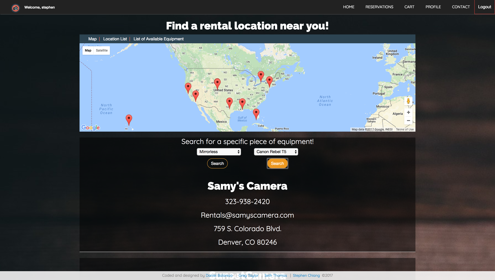
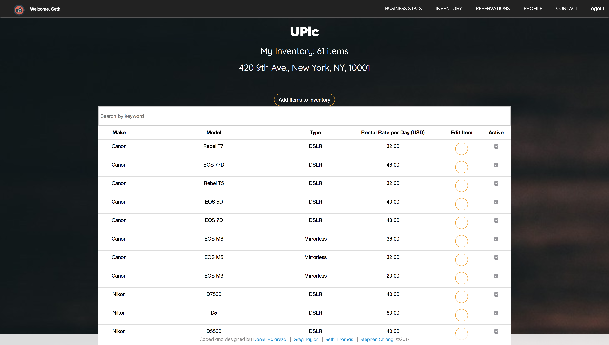

# Summary
A web-app for users who travel and wish to rent camera equipment to try out or perhaps forgot to bring. This a collaborative project developed on a stack consisting of the Java JPA API, the Spring MVC framework, and MySQL database technologies. The data is consumed and manipulated on the front-end using HTML5, CSS3, and the AngularJS framework. Additionally, the web-app utilizes certain modules of the Google Maps API to dynamically display locations of stores.

JUnit tests were written to ensure proper mapping of the entities before moving from JPA to SpringMVC. We then tested the DAO methods to ensure proper CRUD functionality and session persistence of a user. We had to repeatedly go back to the DB and entities to sort through the mapping as we attempted to adhere to a normalized database structure.

|Role & Responsibilities                                              | Team Member        |
|---------------------------------------------------------------------|--------------------|
|Project Team Lead and Overall Design, MVC, AngularJS                 | Stephen Chiang     |
|Database Architect, Controller, and DAO lead                         | Seth Thomas        |
|Database Admin, DAO, and material researcher                         | Daniel Balarezo    |
|Entities, JPA and Google Maps API lead                               | Greg Taylor        |

It was necessary to develop two sides for the web-app, and develop flow and logic for a user looking to rent equipment find, reserve and book from a store, while a lister who owns a store would see different options to manage inventory and get business statistic insights. Additionally, we implemented bcrypt and a more robust authentication controller so that passwords were no longer stored in the DB as plaintext.

Consuming the Google Maps API alongside angular proved to be challenging. Time prevented us from fully utilizing the API where it would provide directions to the store based on the current location of the user, gathered from the user's IP address. However, we did manage to dynamically display all the locations of stores in the database by converting address to latitude and longitude and storing them as part of the address object.

### User stories:
1. User / Lister can register, login, logout, and deactivate account.
2. User can search for equipment through map, global equipment list, store list, and search input.
3. Lister can create a store and manage equipment as well as deactivate items.
4. User can reserve items and book a reservation.
5. Lister can review the store's reservations and get statistics such as number of items reserved and total revenue.
6. User is given an error page with options to recover from a 404.

## If more time were allotted:
* Implement payments API.
* Messaging function between user and lister.
* Notifications of new reservation.
* Rating of equipment or rental experience.
* Directions to store based on selected map marker.
* Include additional JS libraries such as ChartJS.

## In This Document
1. [How to Execute](#how-to-execute)
2. [Project Flow & Structure Overview](#cProject-Flow-&-Structure-Overview)

<p align="center">

</p>
<p align="center">

</p>
<p align="center">

</p>
<p align="center"></p>

## How to Execute
- The web-app is hosted on my AWS server: <a href="http://www.chiangs.ninja:8080/RESTPicSure/">**here**</a>

## Project Flow & Structure Overview

<p align="center">


</p>

## Code Examples
This is a snippet of the our map code, the first is the html and is populated by the ng-repeat provided by the second block of code as strings [latitude, longitude] which are provided from an asynchronous request to the database for all stores and their address objects.
```HTML
<div ng-show="vm.showTable" id="mapDiv">
		<div id="map" map-lazy-load="https://maps.google.com/maps/api/js" map-lazy-load-params="{{vm.googleMapsUrl}}">
			<ng-map center="41,-87" zoom="3">
			<marker ng-repeat="mk in vm.markers" position="{{mk}}" on-click="vm.showStore(mk,data)">
		</div>
	</ng-map>
</div>
```
```JS
userService.listStores().then(function(res){
		vm.locations = res.data;
		for (var i = 0; i < vm.locations.length; i++) {
			vm.markers[i] = '[' + vm.locations[i].address.latitude + ',' +
				vm.locations[i].address.longitude + ','+ JSON.stringify(vm.locations[i]) + ']';
		}
		return vm.markers;
		})
```

## Technologies Used
- Java JPA API
- Spring framework
- MySQL database
- HTML/CSS
- AngularJS
- Google Maps API
